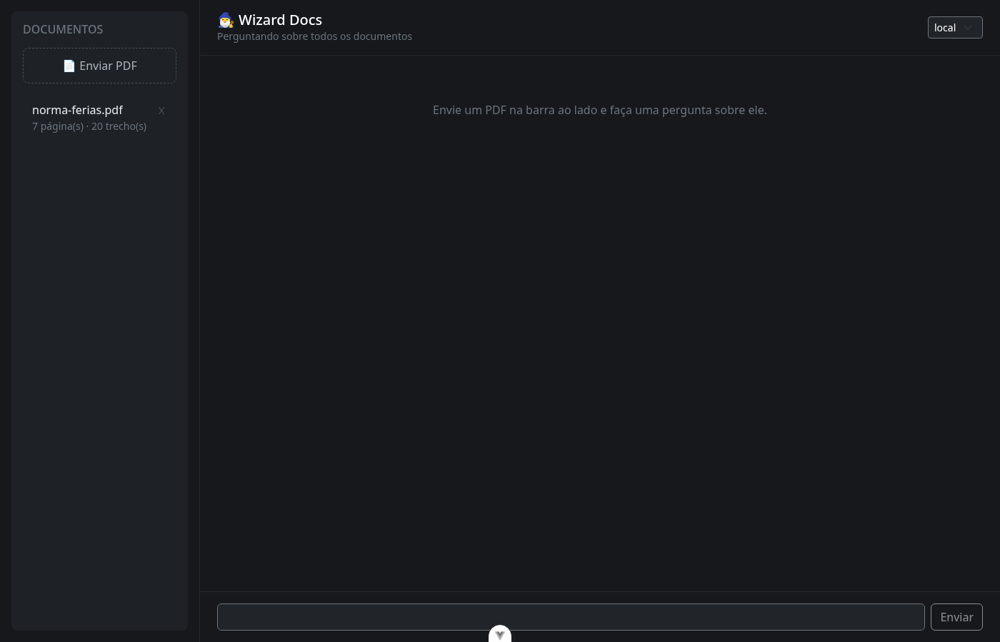
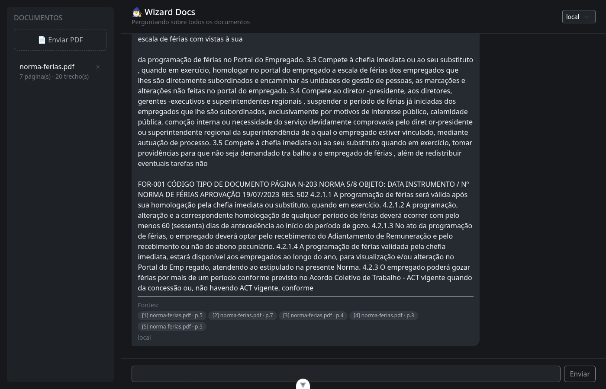

# WizardDocs

[](LICENSE)

**Converse com seus PDFs usando RAG, com citações e sem alucinação.**

O WizardDocs indexa o conteúdo de PDFs por significado e responde perguntas sobre eles usando um LLM (OpenAI ou Google Gemini). Toda resposta cita a página de onde veio a informação, e se o documento não tiver a resposta, o WizardDocs diz isso em vez de inventar.

<div align="center">
  
  
</div>

Capturas com a [Norma de Férias da Codevasf](docs/examples/norma-de-ferias-codevasf.pdf), documento público usado como exemplo.

## Features

- Upload de PDF com deduplicação (reenviar o mesmo arquivo não reprocessa)
- Chat com histórico: uma pergunta de acompanhamento é reescrita antes da busca
- Busca semântica multilíngue
- Respostas citam página e arquivo de origem; sem trecho relevante, sem chamada ao LLM
- Dois provedores de LLM (OpenAI e Gemini), trocáveis por pergunta
- Embeddings locais por padrão, ou via API do Gemini

## Stack

<a href="https://fastapi.tiangolo.com/" target="_blank">
  
</a>
<a href="https://www.trychroma.com/" target="_blank">
  
</a>
<a href="https://www.sbert.net/" target="_blank">
  
</a>
<a href="https://ai.google.dev/" target="_blank">
  
</a>
<a href="https://platform.openai.com/" target="_blank">
  
</a>
<a href="https://vuejs.org/" target="_blank">
  
</a>
<a href="https://www.mongodb.com/" target="_blank">
  
</a>
<a href="https://www.docker.com/" target="_blank">
  
</a>

### Bibliotecas complementares

[pypdf](https://pypdf.readthedocs.io/) <br>
[google-genai](https://googleapis.github.io/python-genai/) <br>
[motor](https://motor.readthedocs.io/) <br>
[pytest](https://docs.pytest.org/) <br>
[Bootstrap](https://getbootstrap.com/) <br>

## Como funciona

```
Upload do PDF
  ├─ hash SHA-256: se o mesmo arquivo já foi indexado, nada é reprocessado
  ├─ pypdf extrai o texto página por página e divide em trechos (~1000 caracteres, sobreposição de ~150)
  ├─ cada trecho vira um vetor (local, por padrão; ou via API do Gemini)
  ├─ ChromaDB grava vetor + arquivo + página, com distância de cosseno
  └─ (opcional) o LLM padrão gera um resumo do documento, salvo no MongoDB

Pergunta
  ├─ se há histórico, o LLM reescreve a pergunta como independente
  ├─ a pergunta vira vetor; o ChromaDB devolve os trechos mais próximos e descarta os irrelevantes
  ├─ se não sobrar nenhum trecho relevante, o LLM nem é chamado
  └─ os trechos vão numerados para o LLM, que responde citando de qual trecho tirou cada informação
```

## Endpoints

| Método | Rota | Descrição |
|---|---|---|
| `POST` | `/api/upload-pdf/` | Envia um PDF (`multipart/form-data`, campo `file`) |
| `GET` | `/api/documents/` | Lista os arquivos indexados |
| `DELETE` | `/api/documents/{arquivo}` | Remove um documento do índice |
| `POST` | `/api/query/` | Faz uma pergunta (`question`, `provider`, `top_k`, `source`, `history`) |
| `GET` | `/api/providers/` | Provedores de LLM configurados e o padrão |

```bash
curl -F "file=@manual.pdf;type=application/pdf" localhost:8001/api/upload-pdf/

curl localhost:8001/api/query/ -H 'content-type: application/json' \
  -d '{"question": "Quantos dias de férias eu tenho?", "provider": "gemini"}'
```

Documentação completa dos schemas em `/docs` (Swagger).

## Desenvolvimento

### Pré-requisitos

- Python >= 3.10
- Node.js >= 18
- Docker (opcional, para subir tudo de uma vez)

### Com Docker

```bash
cp backend/.env.example backend/.env   # preencha OPENAI_API_KEY e/ou GEMINI_API_KEY
docker compose up --build
```

API em http://localhost:8001 (docs em `/docs`), frontend em http://localhost:5173.

### Rodar em modo desenvolvimento

```bash
# backend
cd backend
python3 -m venv .venv && source .venv/bin/activate
pip install torch --index-url https://download.pytorch.org/whl/cpu
pip install -r requirements-dev.txt
cp .env.example .env
cd app && uvicorn main:app --reload

# frontend, em outro terminal
cd frontend
npm install
npm run dev
```

Sem nenhuma chave de LLM configurada, a API sobe normalmente: upload, listagem e busca continuam funcionando no modo `local`.

### Testes

```bash
cd backend && pytest
```

### Configuração

Variáveis de ambiente em `backend/.env` (veja `.env.example` para a lista completa e os valores padrão): chaves de `OPENAI_API_KEY`/`GEMINI_API_KEY`, `EMBEDDING_PROVIDER` (`local` ou `gemini`), tamanho de chunk, limiar de relevância e `MONGO_URI` para persistir os resumos.
